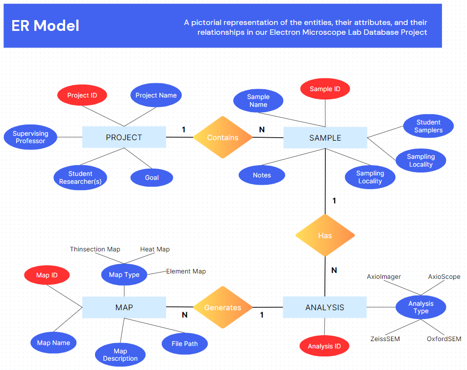

# **Beneski Electron Microscope Lab Database Project**
Developed by: **Ian Kamweru, Guilherme Santos, Abdul Rauf, & Arjun Kejriwal**

## **Background & Project Statement**
The Beneski Scanning Electron Microscope Lab faces the challenge of managing a substantial dataset comprising approximately 2 terabytes of images and point data originating from geological specimens collected worldwide. The data consists of a wide array of samples, ranging from microscopic rock formations to intricate mineral structures, captured using light microscopes and scanning electron microscopes. 

All of the data is stored on a TrueNAS Scale server encompassing the output from two distinct microscopes and two specialized mineralogic software. There is a need for a cohesive data management system that will allow consolidation of data for each project's samples. This will help lab users access all their relevant sample data quickly from both microscopes and mineralogic software streamlining their user experience.

The successful implementation of this database will not only benefit the Beneski Scanning Electron Microscope Lab but also contribute to the advancement of research endeavors across various natural science disciplines at Amherst College and the Five Colleges.

## **Proposed Solution**
Our solution involves setting up a PostgreSQL database to store the lab projects' metadata with a React-based front-end allowing researchers to interact with the database. This database will streamline the consolidation of data including images obtained from the microscope, mineralogic analysis point data from various sources, and file paths representing the storage location in the TrueNas server. Additionally, a Node.js and Express.js API layer will facilitate communication between the front end and the database.

### User stories
1. As a lab user, I want a system that automatically consolidates images and CSV files related to a specific rock sample so that I don't have to manually search through server folders.
2. As a lab user, I want to access metadata associated with my project, such as project details, professor(s), etc.
3. As a lab user, I want to be able to retrieve all files for all the samples within my project.
4. As a lab user, I want to access metadata associated with each sample, such as sample location, etc.
5. As a lab user, I want the ability to access all related images and CSV files for a specific sample.

## **ER Model**
We have 4 entities:

1. **Project**: An abstraction of the research project at hand. Under a project, a researcher can have multiple rock samples under study.
2. **Sample**: A rock/mineral sample taken for the purpose of analysis. We can have multiple analysis types performed on a sample.
3. **Analysis**: There are 4 types of analysis taken on a sample ie 
    - **AxioImager** - Full thin-section images of the sample taken by the microscopes
    - **AxioScope** - Small region of interest (ROI) inset maps taken on the light microscope to highlight a smaller section for analysis
    - **OxfordSEM** - Full thin-section heat maps of an element of interest. Point data in the form of CSV files are also exported to represent the mapping of all elements in the sample.
    - **ZeissSEM** - Point data on the elemental composition of each element in the sample generated by mineralogic software.
4. **Map**: A map is either an image taken from the microscopes in .tif or .czi format from the AxioImager and AxioScope, or point data in .csv or .txt format from mineralogic analysis software, ZeissSEM and OxfordSEM.

## Software Installed
- **postgresql v13.11 - database management system :** `sudo yum install postgresql-server`
- **vim v8.2 - text editor :** `sudo yum install vim`
- **git v2.39.3 = version control :** `sudo yum install git`
- **node v16.20.2 - JavaScript runtime environment :** `sudo yum install nodejs`
- **npm v8.19.4 - package manager for Node.js :** `sudo yum install nodejs`

## **Milestones**
### Phase 1
- [x] **Meet with the customer**
- [x] **Preliminary ER Diagram**
- [x] **Create a design document with the project statement**
- [x] **Create a project repository on GitHub**

### Phase 2
- [x] **Pitch idea to the customer and refine ER Model if necessary**
- [x] **Finalize ER schema**
- [x] **Preliminary relational schema code & diagram**
- [x] **Role assignment**
- [x] **Set up Linux server & install dependencies**

### Phase 3
- [ ] **Complete the conversion of the ER schema into the relational schema**
- [ ] **Create and populate the database and the tables needed**
- [ ] **example SQL queries that showcase the different ways the user can interact with the database**
- [ ] **Start implementing the API layer in NodeJS and ExpressJS**
- [ ] **Start implementing the front end in React**

## **Stretch Goals**
- [ ] **Containerize the platform in a Docker image**
- [ ] **Deploy the docker image on the actual TrueNAS server where real data is stored**

## Open Questions
1. What search & filter capabilities should we implement if any? *At the moment, we aim to provide search capabilities by `project-name` and `sample-name`*
2. Is there a way we can store the path to a folder rather than a specific file as the mineralogic software sometimes generates folders with multiple images and csv's in them rather than single files?
3. How do we access the file system of the TrueNAS Scale server in order to extract file paths?
4. How do we create symbolic links to the files on the server to allow users to be directed to the specific file when they click on a particular one in the UI?

## Role Assignments
| Ian | Guilherme | Abdul | Arjun |
|----------|----------|----------|----------|
|- Create & populate the database and tables needed |- Complete conversion of ER schema to a relational schema in normal form |- Complete conversion of ER schema to a relational schema in normal form |- Create & populate the database and tables needed |
|- Build the API layer in JavaScript | - Build the API layer in JavaScript |- Build the API layer in JavaScript |- Devise example SQL queries to show interaction with the database |
|- Build the front end in React |- Build the front end in React |- Build the front end in React |- Build the front end in React |

