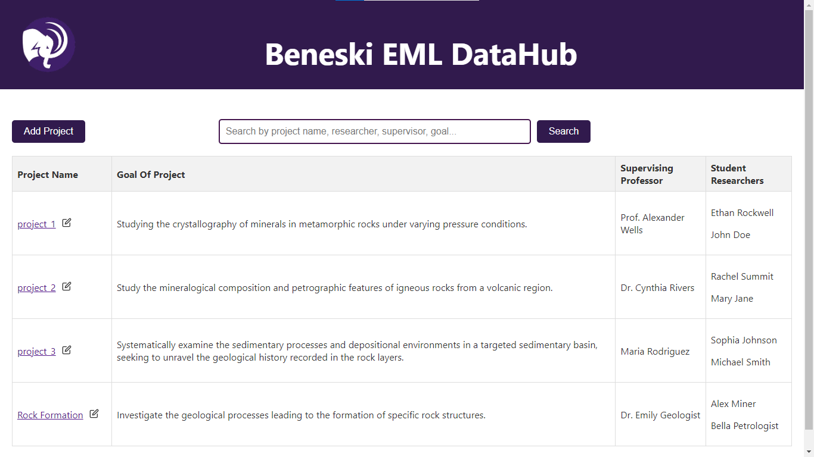
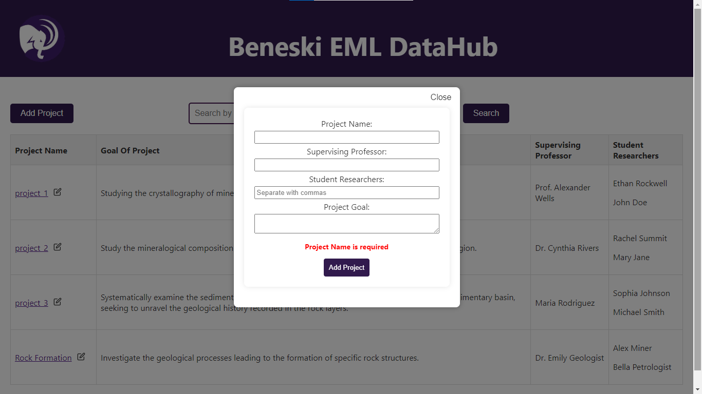
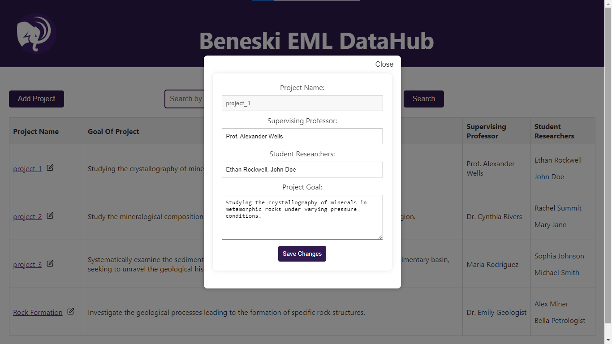
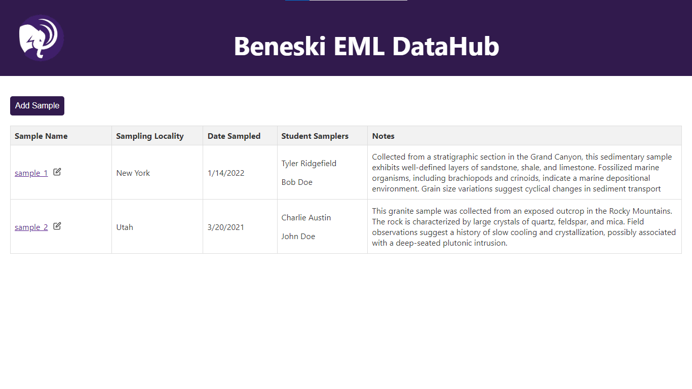
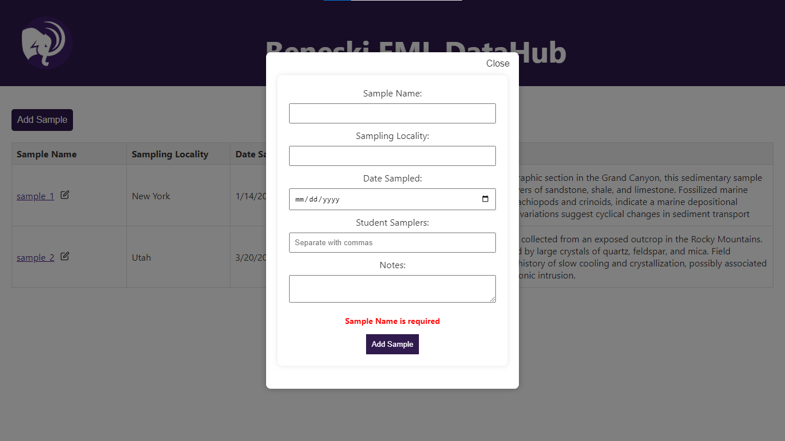
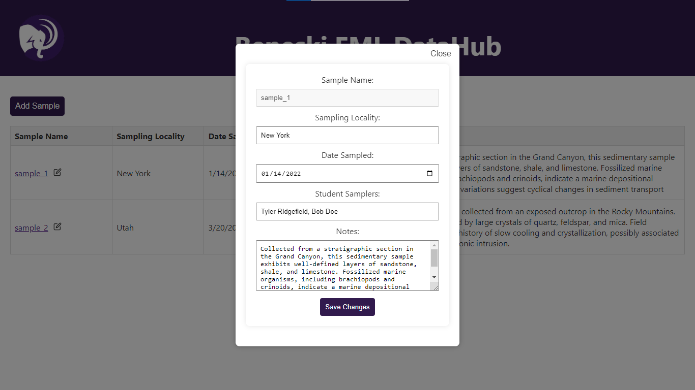
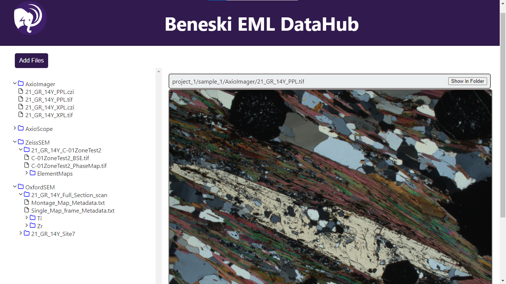
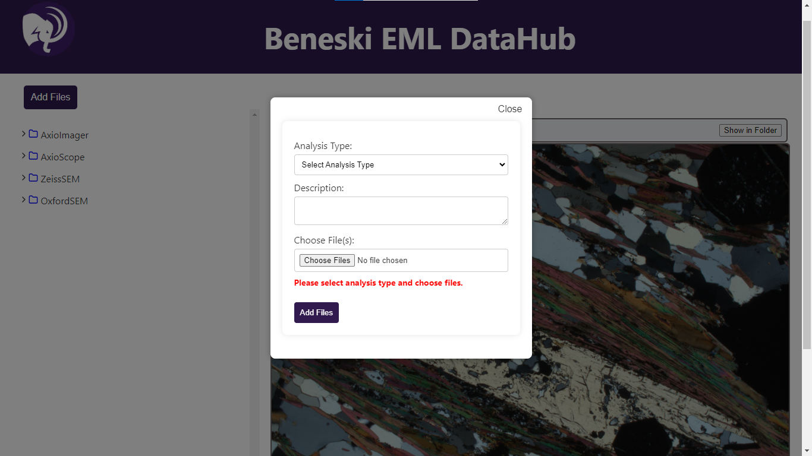

## **<u>Home page</u>**
Displays the projects in the database.

## **<u>Add Project</u>**
Create a new project using the Add Project button:

## **<u>Edit Project</u>**
Edit an existing project by clicking the edit icon:

## **<u>Sample Page</u>**
Displays the samples when the user clicks on a project.

## **<u>Add Sample</u>**
Create a new sample using the Add Sample button:

## **<u>Edit Sample</u>**
Edit an existing sample by clicking the edit icon:

## **<u>Analyses Page</u>**
Displays the 4 analyses types and their file trees when the user clicks on a sample.

## **<u>Add Files</u>**
Add files under a sample using the Add Files button:
